# 2021_PPS_VOTAR

   Link al form https://forms.gle/nauVzL5CmyP3rkLG6

# SISTEMA VOT.AR
## GRUPO 10

## Tecnologías utilizadas:
- Angular 8
- Angular Material
- Bootstrap
- HTML5
- CSS3
- PHP-> MYSQL/FIREBASE

# ENTREGAS 

### Entrega X/X -
### README, Login con perfiles y pantallas 

## Screenshots:

## - Home
### Version anterior:

### Update:
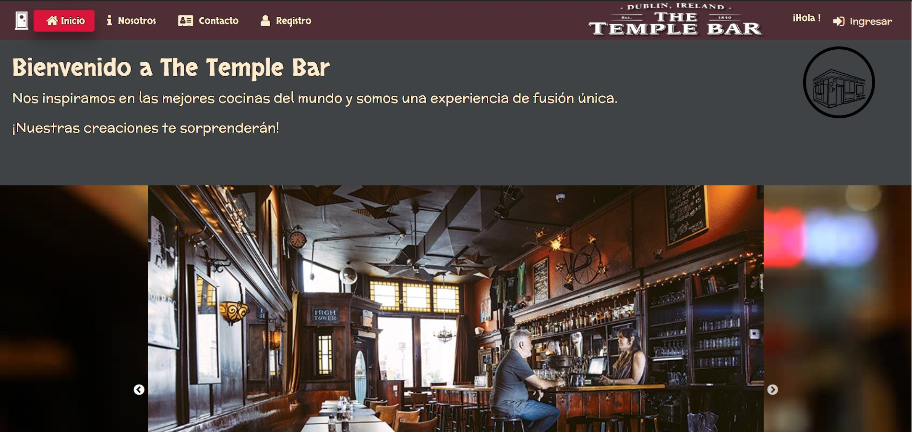

## - Login
### Version anterior:

### Update:

### Entrega 24/10 -
### Captcha, subido a la web.  

## - Registro
### Version anterior:
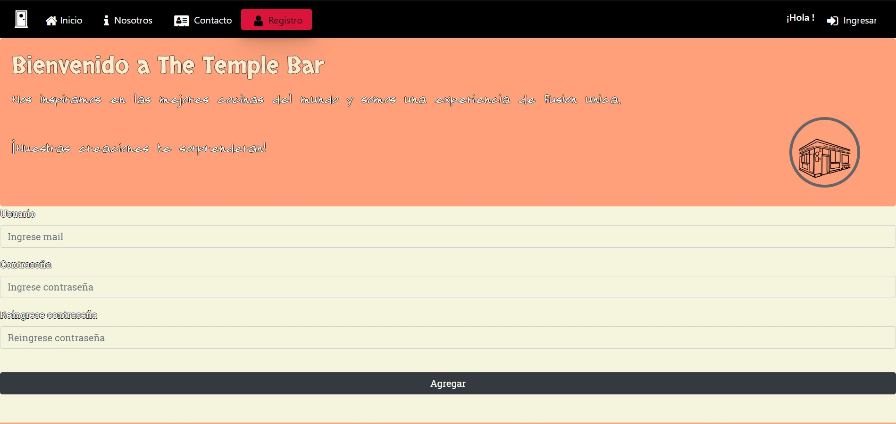
### Update:
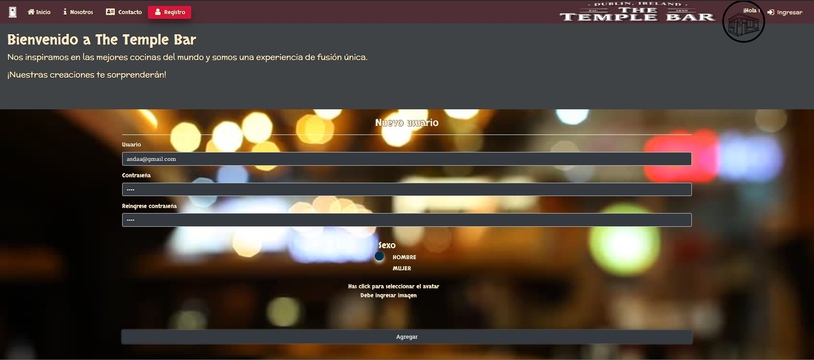

## - Captcha

### Entrega 07/11 -
#### Generar documentos PDF, manejo de imagenes.  

## - Documentos PDF
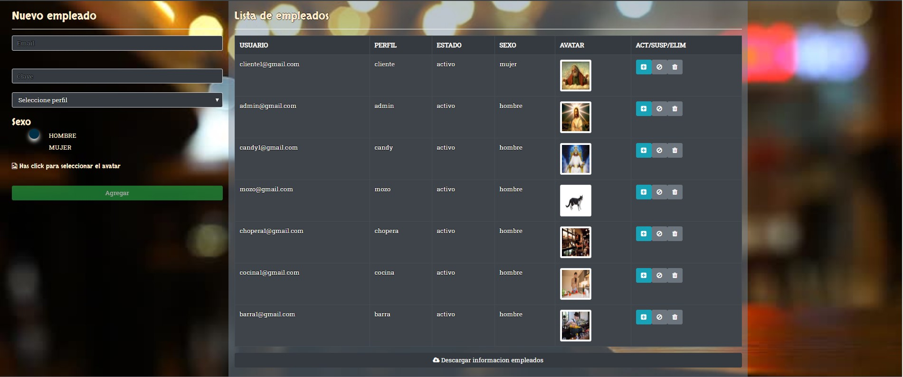
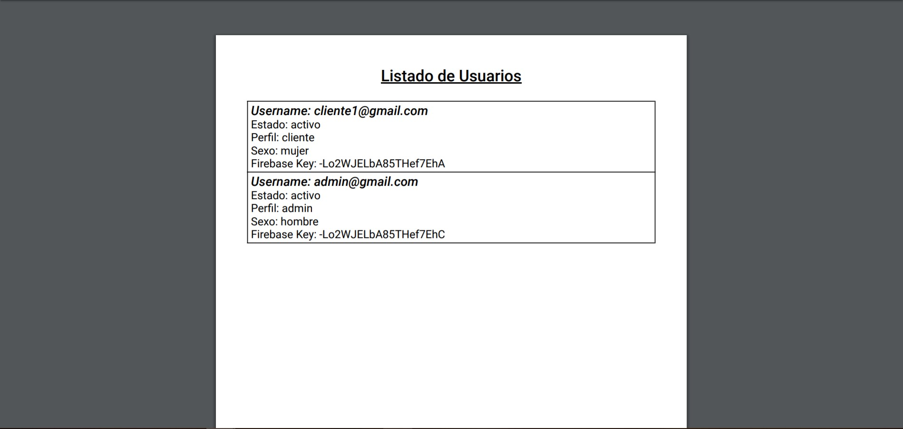

## - Manejo de imagenes
##### En registro:
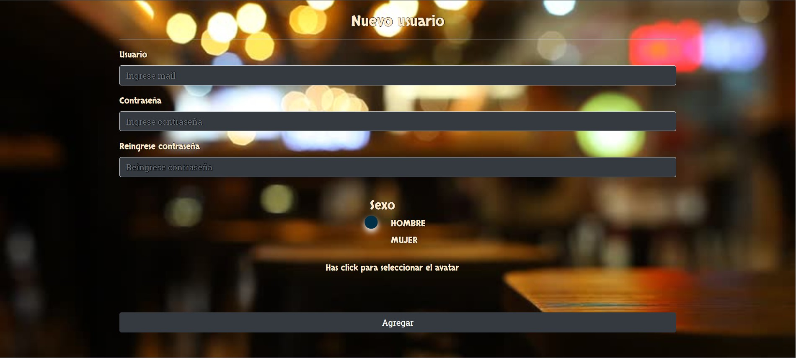

##### Desde administración:
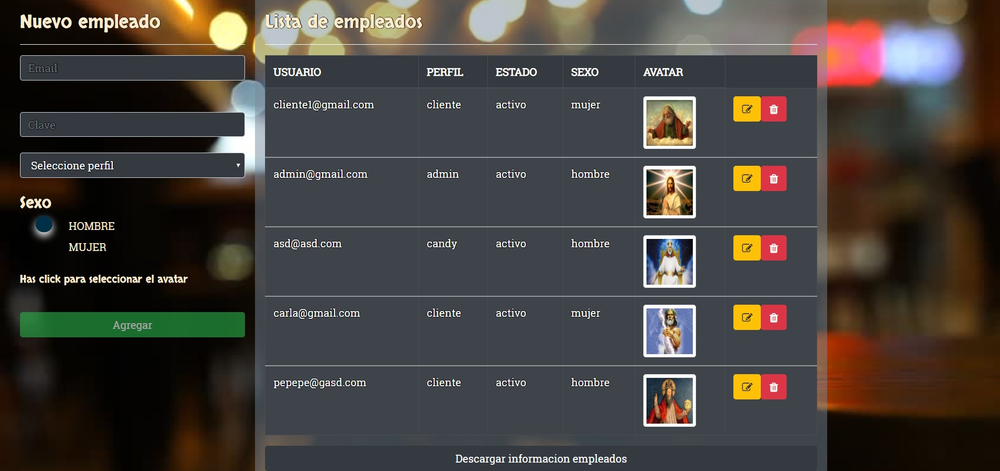

### Entrega Final 28/11 -
## Circuito completo .  
#### 1 Logearse como mozo 
#### 2 Cargar pedido con imagen. 
#### 3 Descagar detalle del pedido para darselo al cliente.
#### 4 Logearse como cliente y verificar el pedido. 
#### 5 Logearse con los respectivos usuarios responsables y preparar el pedido.
#### 6 Logearse como cliente y verificar el pedido. 
#### 7 Completar la encuesta.
#### 8 Logearse como mozo y verificar el estado de la mesa.
#### 9 Como mozo, servir el pedido. 
#### 10 Como mozo, cobrar mesa.
#### 11 Logearse como admin.
#### 12 Cerrar la mesa. 

##### Listado pedidos pendientes:
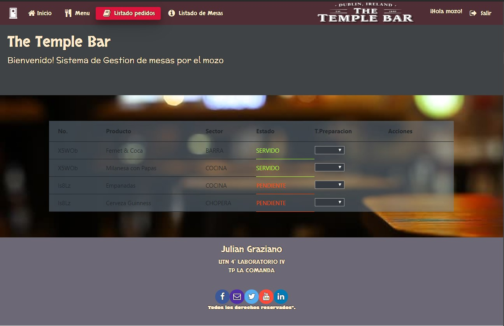

##### Crear pedido - Menu:
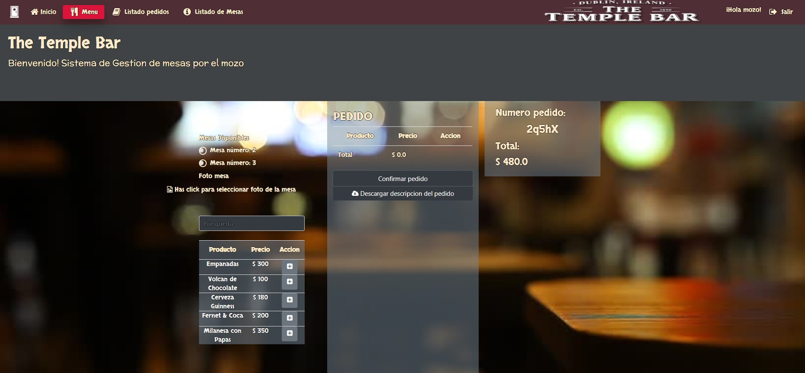

##### Preparar pedido por perfiles:
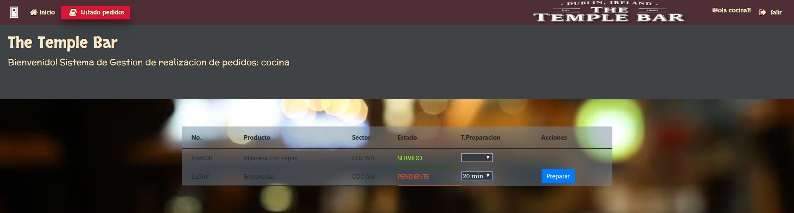

##### Servir pedido por perfiles:
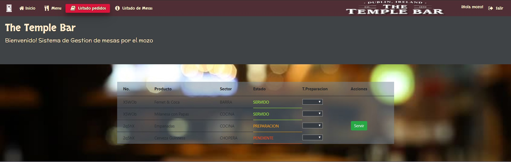

##### Cobrar Mesa - Mozo/Admin:
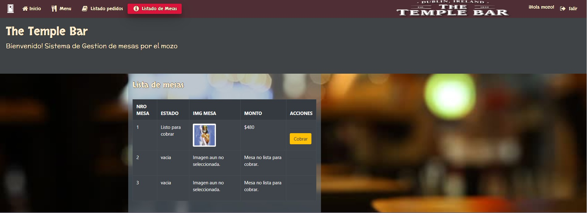

##### Cerrar Mesa - Admin:
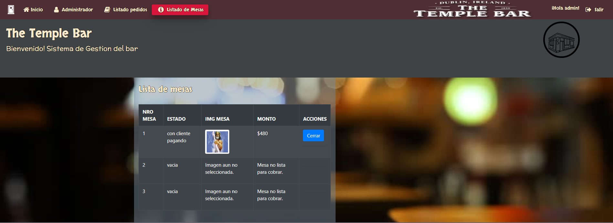

