# 2021_PPS_VOTAR

# SISTEMA VOT.AR
## GRUPO 10
##**Julian Graziano**
##**Matias Perez**
##**Leandro Pollola**

## Tecnologías utilizadas:
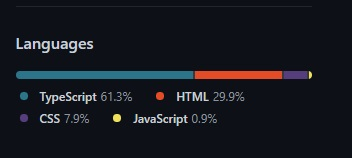

- Angular 8
- Angular Material
- Bootstrap
- HTML5
- CSS3
- PHP-> FIREBASE

## Anexo Tecnológico:

### Estructura y utilización de pilares POO
- Ejemplo de objeto de tipo clase: “escuela”
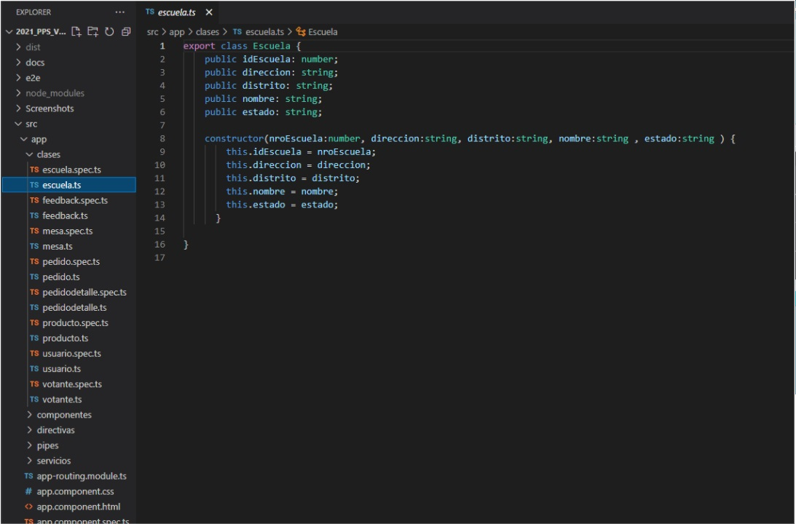
#### Ejemplo de los distintos tipos de objetos, utilizando Angular para su gestión y correspondiente separación de funciones:
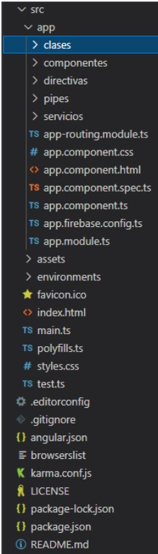

### Github
Se utilizaron distintos servicios de esta interfaz web que usa Git. El más utilizado actualmente por los desarrolladores.
- Revisión de código de a pares
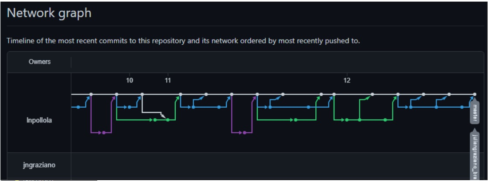
- Branches
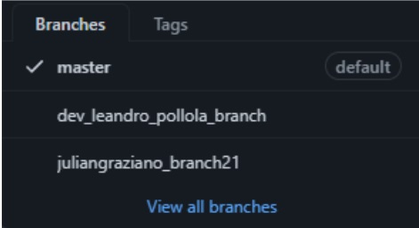

#### Github Page
- Se utilizó como herramienta para el correspondiente deployment, el cual implica validaciones y revisión de todas las líneas de código implicadas, teniendo que solucionar cualquier inconveniente encontrado para que pueda cumplimentarse el deployment
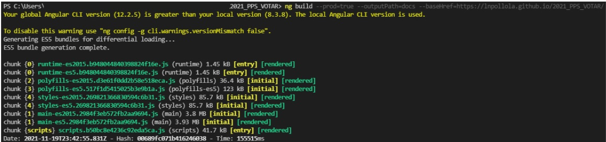

## Screenshots Mockups:

### Home
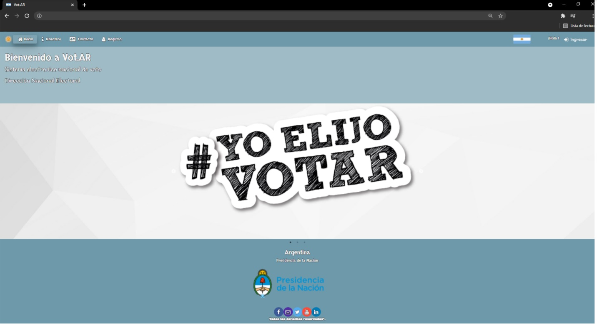

### Contacto
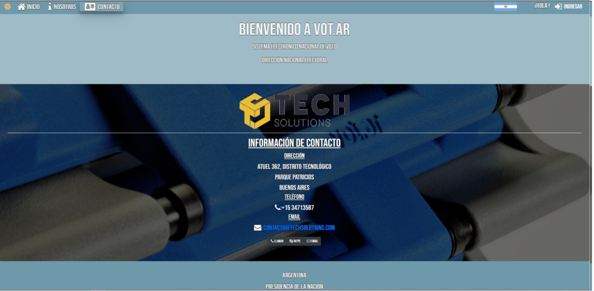

### Login
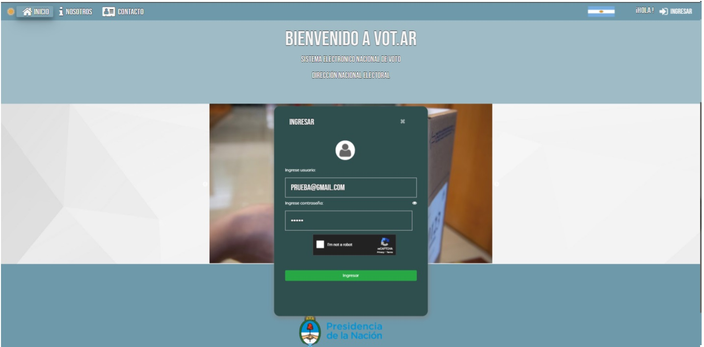

### - Entrega Final 1.0: Aplicación 20/11/2021
#### - Circuito Votación Electoral: 
   - Se agregó a la aplicación el sistema completo de voto con el padrón electoral.

##### Si el votante no está registrado. El PRESIDENTE puede ir a registro y agregarlo
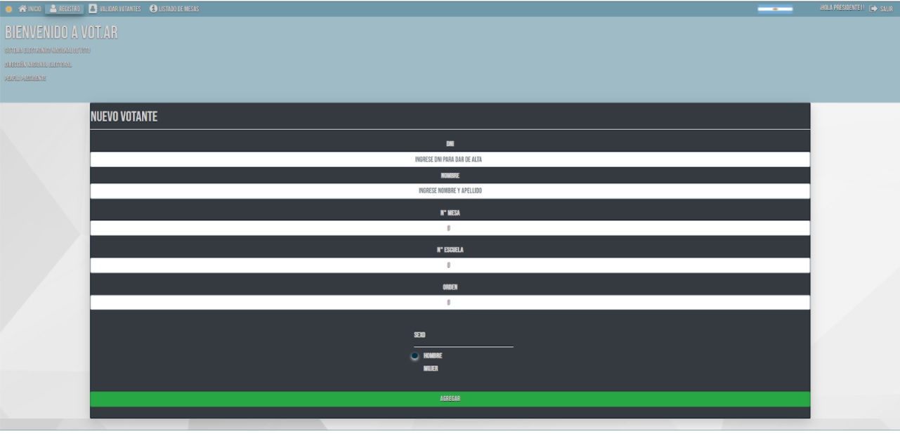

##### Una vez el votante registrado, en el home principal, ingresa su DNI para buscarse en el padrón electoral
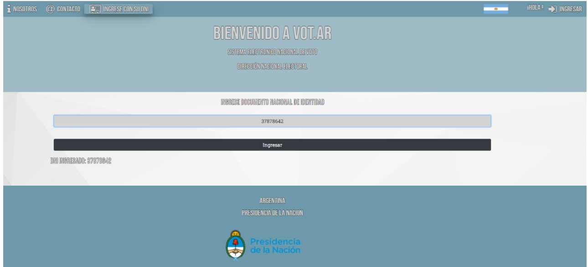

##### Si el usuario no está validado por el AUXILIAR y el PRESIDENTE, podrá observar su información en el padrón electoral.
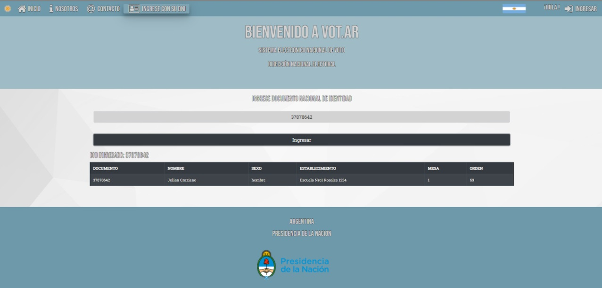

##### El AUXILIAR ingresa a la aplicación y puede ver los votantes disponibles para validar.
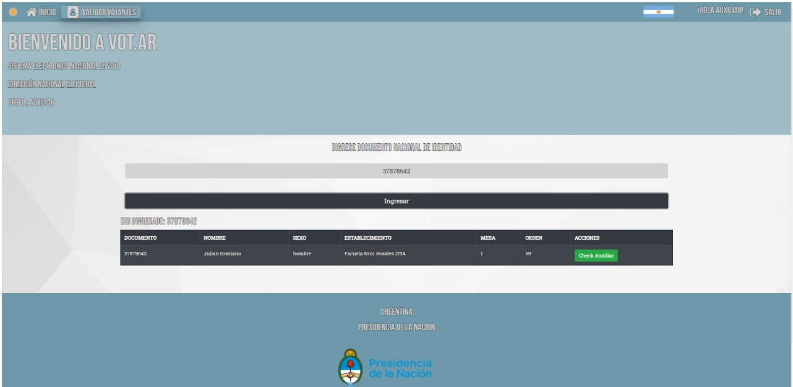

##### El PRESIDENTE ingresa a la aplicación y puede ver los votantes disponibles para validar, que previamente hayan sido validados por el AUXILIAR.
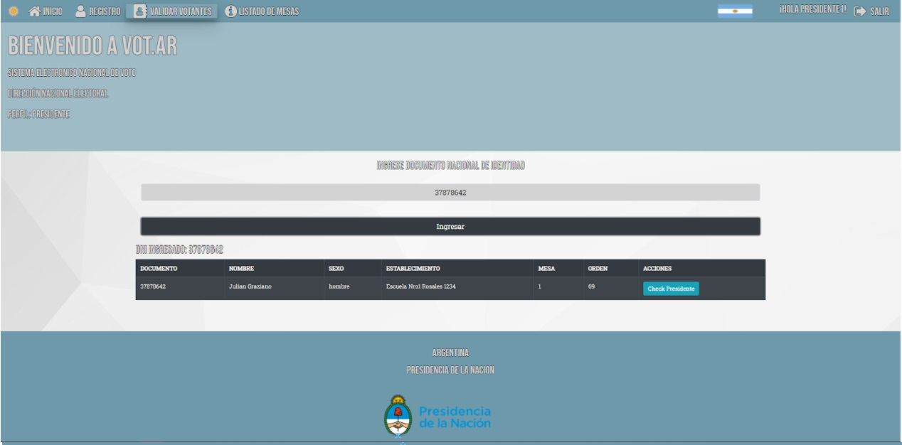

##### Al tener las dos validaciones, cuando el votante ingrese su dni lo llevará al menú de voto (carousel), donde puede elegir entre los postulados.

##### Se informa a quién eligió en la votación y lo redirige automáticamente a la encuesta. El votante ahora si vuelve a buscarse con su DNI, irá redirigido al home.
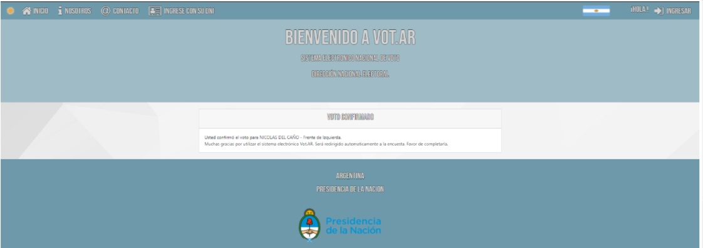
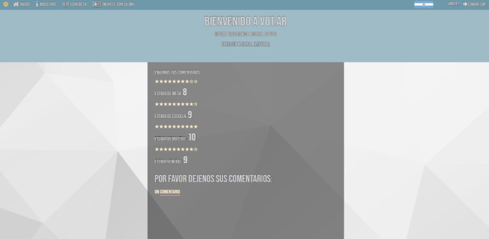

##### El FISCAL ingresa a la aplicación y puede ver el listado de mesas a validar.
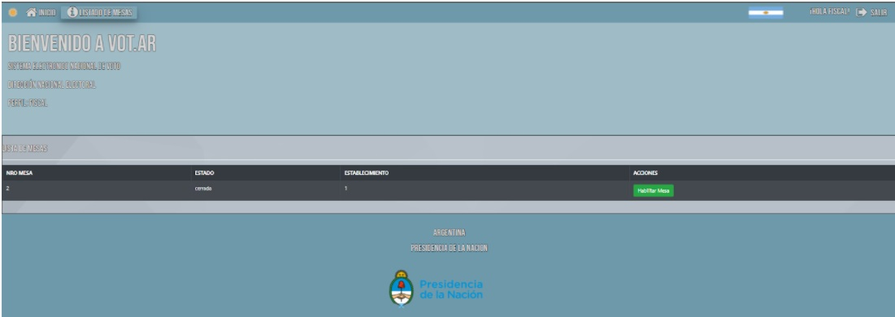
#####  El PRESIDENTE ingresa a la aplicación y puede ver el listado de mesas a validar, previamente validadas por el FISCAL
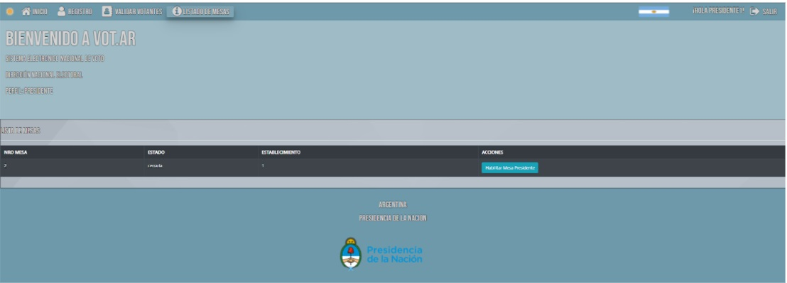

##### Con respecto a la escuela, el FUNCIONARIO ingresa a la aplicación, puede ver el listado de escuelas disponibles para su correspondiente apertura/cierre.
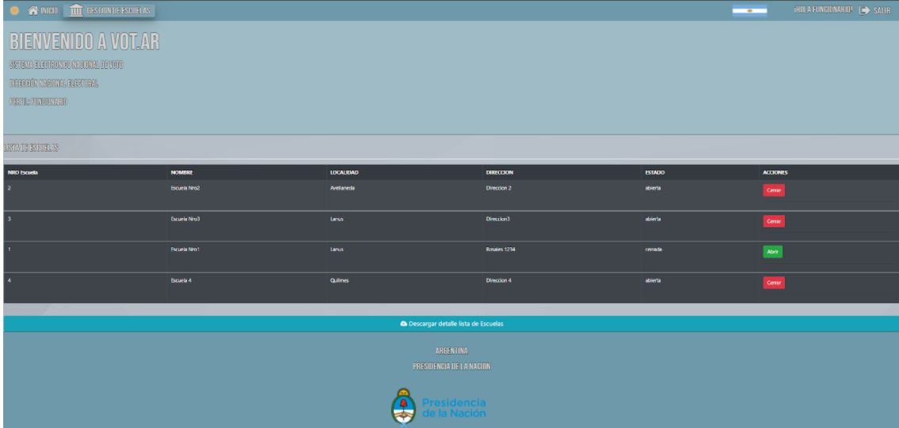

